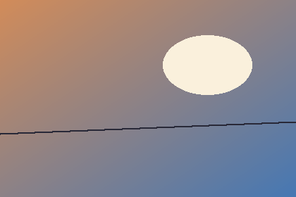

# Image reveal

Prose above the image, so the reflow is easy to see.

Prose below the image stays put — only the image's own line reflows when
the caret lands on it (the source reveals and the image dims below it).
